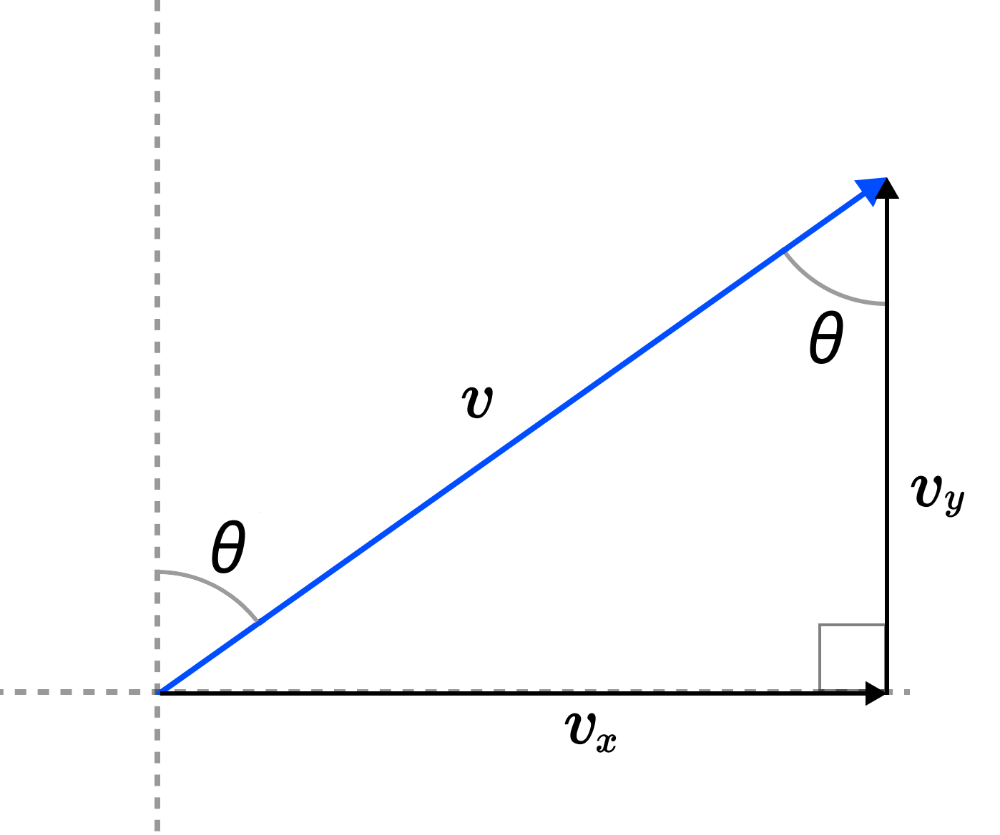

# Airplane Control

This application visualizes a top down, 2-dimensional view of an airplane during flight. The application displays the live trajectory of the plane during travel, and allows the user to modify the airplane's **airspeed** (in knots) and **yaw** (in degrees).

## Basic Assumptions/Decisions

- the plane can maintain flight at any positive speed (even though in real life, planes must travel a minimum airspeed to generate adequate lift)
- the max speed of the plane is 550 knots (this is similar to that of real commercial airliners)
- the pilot can only make a *single* turn per maneuver (so you must wait until one turn completes before performing another)
- the pilot cannot change the airspeed of the plane mid-turn
- the pilot cannot turn more than 90 degrees relative to the direction of travel in a *single* turn (but can make two or more successive turns to exceed this limitation)
- any time the plane's airspeed is reduced to zero, it is assumed to have landed (safely), and must be re-launched to go back into flight
- rather than having the plane go off the canvas, the "camera" updates each time the plane moves to follow it 
- the pilot can turn the plane 1 degree per unit time 

## Modeling Airplane Trajectory

The airplane's trajectory of course will depend on its airspeed, which we will denote with $v$, and its yaw, which we will denote with $\theta$. The basic situation is depicted below:



**IMPORTANT:** Notice that yaw is measured as the angle the plane's velocity vector forms with absolute north. In this sense, we can think of $\theta$ as the "absolute yaw", whereas the pilot has a separate, "relative" notion of yaw based on the direction the plane is traveling. Keep this in mind below.

From the diagram, we can easily compute the horizontal and vertical components of the velocity as:
```math
v_x = v \sin(\theta), \\
v_y = v \cos(\theta).
```
The position of the airplane at time $t$ is thus:
```math
p(t) = (v\sin(\theta)t,\; v\cos(\theta)t).
```
In the code, we can think of "time" as each instance of the plane (a Python turtle object) moving. Thus, we can update our plane's position incrementally based on the above parametric equation via:
```math
x' = x + v\sin(\theta), \\
y' = y + v\cos(\theta),
```
where $(x,y)$ is the plane's current position. This is almost exactly how I implemented it in the code, with the only difference of including the factor $\frac{10}{550}$ to make the animation slightly smoother and the airspeed differences more obvious.

Now, to correctly aim the airplane in the right direction, we must properly relate the aforementioned "absolute yaw" and the yaw the pilot would measure. We need absolute yaw in order for the parametric equation we derived to be valid. On the contrary, the pilot always wants to be able to measure yaw *based on the plane's current direction of travel*. Call this yaw the "relative yaw" and denote it by $\alpha$. If the plane currently has absolute yaw $\theta$ and wants to perform a turn of yaw $\alpha$, the new absolute yaw $\theta'$ will be given by: 
```math
\theta' = 90 - (\theta - \alpha).
```
The $90$ term comes from the fact Python's turtle module measures north as $90$ degrees (i.e. they measure from the horizontal), and we let the pilot turn anywhere from full left to full right (which is to say $\alpha \in [-90, 90]$). Again due to the way the Python turtle module measures direction, we must subtract the angles rather than add them (i.e. we are computing the *complementary* angle).

The final important point to note about the airplane trajectory is the "smoothness" of the turns. It is not realistic that the pilot can perform the entire turn in one unit of time (this would lead to very jagged flight trajectory). Instead, I decided that at each unit time, the pilot can turn the airplane by $1$ degree in either direction. So the implementation of the equation for $\theta'$ above is done using a loop with increments of $1$ until the pilot completes the turn. In particular, look at the variables `new_direction` and `absolute_yaw` in the code. The position is updated at each incremental change accordingly.

## Running/Using the Application

Launch the application (choose the appropriate command for your system):
```bash
python main.py
python3 main.py
```
Using the application:
- set the "Airspeed" slider to a non-zero value, then click "Launch flight" to begin flying
- move the "Airspeed" slider during the flight to speed up or slow down the plane
- if you reduce the airspeed to 0, the plane will stop ("land"); raise the airspeed to a nonzero value and click "Relaunch flight" to begin flying again
- to execute a turn, first use the "Yaw" slider to select a turning angle, then click "Initiate turn"
- during a turn, the "Airspeed" slider is disabled so you cannot change the speed mid-turn, and new turns are disabled until the current one is completed
- at any time, exit the program with the "Exit" button
